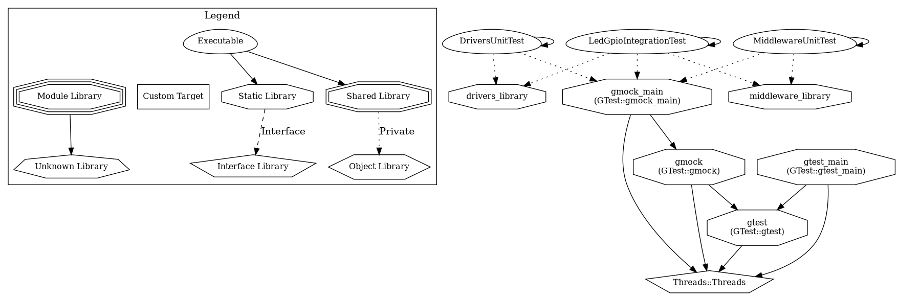

# STM32 C code and Google Test Framework

[](https://en.wikipedia.org/wiki/C%2B%2B)
[](LICENSE)
[](https://github.com/CharlesDias/stm32_gtest_c_code/actions/workflows/unit-test.yml)
[](https://codecov.io/gh/CharlesDias/stm32_gtest_c_code)
[](https://github.com/CharlesDias/stm32_gtest_c_code/actions/workflows/lizard.yml)
[](https://github.com/CharlesDias/stm32_gtest_c_code/actions/workflows/flawfinder.yml)
[](https://github.com/CharlesDias/stm32_gtest_c_code/actions/workflows/cppcheck.yml)

This is a sample project for testing C code for STM32 microcontrollers using the Google Test Framework. Some topics covered:

* Sample project using the NUCLEO-F446ZE board.
* Embedded system without RTOS (bare metal).
* Distinct folders for library, executable, and test code.
* Use of STM32CubeIDE for building and compiling the application project.
* Use of CMake for building the test code.
* Unit and integration tests with the Google Test Framework, including death tests for the asserts.
* Use of gMock for mocking the STM32 HAL functions.
* Code coverage with GitHub Actions and [Codecov](https://codecov.io).
* Code quality analysis with Lizard, Flawfinder, and Cppcheck (with the MISRA C:2012 addon) tools.
* Cppcheck and Flawfinder results shown in GitHub code scanning.
* Failed asserts in the library are printed over USART3 (huart3, 115200 baud).
* Use of Docker container.

I know! Maybe... you're thinking it's over-engineering to blink an LED. However, look on the bright side. The goal is to give an example of how to apply these practices and tools.

## Project structure

``` text
./
├── CMakeLists.txt
├── Makefile
├── codecov.yml
├── cppcheck-suppressions.txt
│
├── cmake
│   └── cmake modules
│
├── docker
│   └── Dockerfile
│
├── docs
│   └── Documentation files
│
├── .github
│   └── workflows
│       └── GitHub workflows
│
├── source
│   ├── CMakeLists.txt
│   │
│   ├── nucleo-f446ze-library
│   │   ├── CMakeLists.txt
│   │   ├── BuildArtifacts
│   │   │   └── Library artifacts
│   │   ├── Drivers 
│   │   │   └── Files generated by STM32CubeIDE
│   │   ├── Inc
│   │   │   └── Files generated by STM32CubeIDE
│   │   ├── Libraries
│   │   │   ├── CMakeLists.txt
│   │   │   ├── Drivers
│   │   │   │   ├── CMakeLists.txt
│   │   │   │   └── Header and source files
│   │   │   └── Middleware
│   │   │       ├── CMakeLists.txt
│   │   │       └── Header and source files
│   │   └── Src
│   │       └── Files generated by STM32CubeIDE
│   │
│   └── stm32-cube-ide
│       ├── BSP
│       │   └── Header and source files
│       ├── Core (Files generated by STM32CubeIDE)
│       │   ├── Inc 
│       │   │   └── Files generated by STM32CubeIDE
│       │   ├── Src
│       │   │   ├── main.c (Sample code)
│       │   │   └── ...
│       │   └── Startup
│       │       └── Files generated by STM32CubeIDE
│       ├── Drivers (Files generated by STM32CubeIDE)
│       │   └── Files generated by STM32CubeIDE
│       └── Project configuration files generated by STM32CubeIDE
│
└── tests
    ├── CMakeLists.txt
    ├── integration
    │   └── led_gpio_integration_test.cpp
    ├── mock
    │   ├── gpio_mock.cpp
    │   ├── gpio_mock.h
    │   ├── hal_gpio_mock.cpp
    │   └── hal_gpio_mock.h
    └── unit
        ├── drivers
        │   └── gpio_test.cpp
        └── middleware
            └── led_test.cpp
```

## Building tests project via CMake

Clone this repo to your local machine:

```console
git clone https://github.com/CharlesDias/stm32_gtest_c_code.git
```

Access the project folder **stm32_gtest_c_code**:

```console
cd stm32_gtest_c_code
```

Pull the latest Docker image used to build the project. It has all the tools the commands below use.

```console
docker pull charlesdias/stm32_gtest
```

Run the Docker image. The `--user` option makes the files created inside the container belong to you instead of root:

```console
docker run --rm -it --user "$(id -u):$(id -g)" -v "$(pwd)":/home/project -w /home/project charlesdias/stm32_gtest
```

If an older command already created a `build` folder owned by root, delete it once with `sudo rm -rf build`.

Inside the Docker container, build and run the tests:

```console
make test
```

### Make commands

Run these commands inside the Docker container:

| Command | What it does |
|---|---|
| `make` or `make build` | Configures and builds the test project |
| `make test` | Builds and runs all tests |
| `make coverage` | Runs the tests with coverage; open `build/coverage/index.html` to see the report |
| `make gtest_report` | Runs the tests and writes an HTML report to `build/gtest-report.html` |
| `make cppcheck` | Checks the library code with Cppcheck and its MISRA C:2012 addon; see `build/cppcheck-report.txt` |
| `make doxygen` | Generates the documentation; open `docs/html/index.html` |
| `make dependency` | Draws the dependency graph of the CMake targets in `build/graph_image.png` |
| `make clean` | Deletes the `build` folder |

### Dependency graph

Dependency graph for the test project, generated with `make dependency`:



## Building application project via STM32CubeIDE

Clone this repo to your local machine:

```console
git clone https://github.com/CharlesDias/stm32_gtest_c_code.git
```

Open the STM32CubeIDE and import this project.

Build and load the firmware on NUCLEO-F446ZE board. See the expected output.


## Improvement suggestions

* Add some function example to increase the CCN (cyclomatic complexity number).
* Add some function example with security weaknesses to test the Flawfinder.
* Build the application project via CMake.
