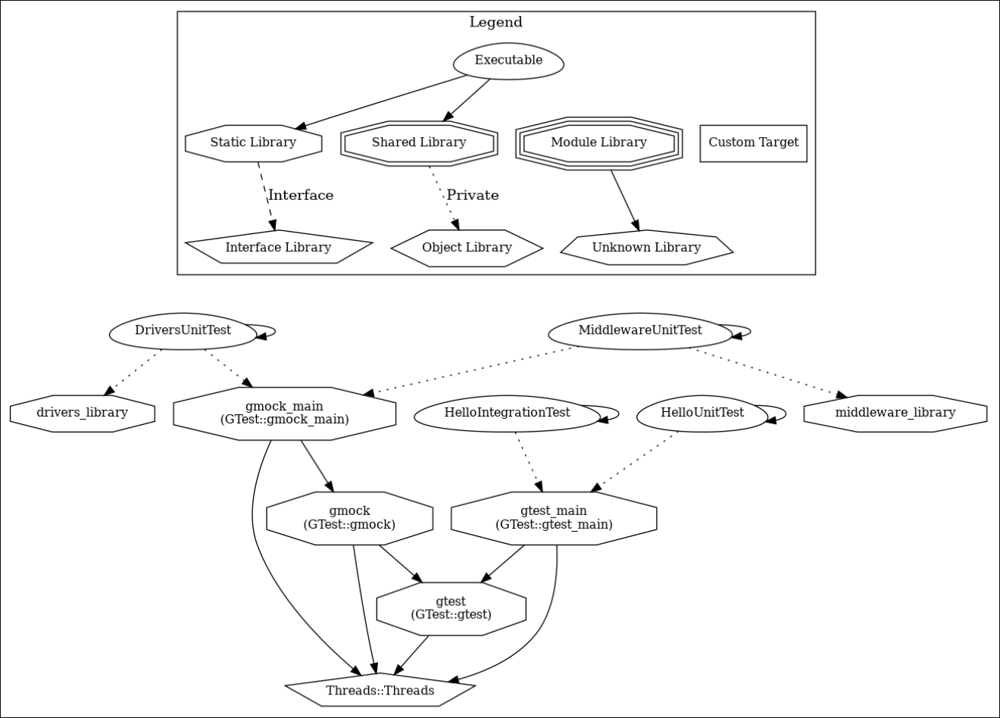

# STM32 C code and Google Test Framework

[](https://shields.io/)

[](https://github.com/CharlesDias/stm32_gtest_c_code/actions/workflows/unit-test.yml)
[](https://codecov.io/gh/CharlesDias/stm32_gtest_c_code)
[](https://github.com/CharlesDias/stm32_gtest_c_code/actions/workflows/lizard.yml)
[](https://github.com/CharlesDias/stm32_gtest_c_code/actions/workflows/flawfinder.yml)

This is a sample project for testing C code for STM32 microcontrollers using the Google Test Framework. Some topics covered:

* Sample project using the NUCLEO-F446ZE board.
* Embedded system without RTOS (bare metal).
* Distinct folders for library, executable, and test code.
* Use of STM32CubeIDE for building and compiling the application project.
* Use of CMake for building the test code.
* Testing C code via Google Test Framework.
* Use GMock for mocking the STM32 HAL functions.
* Code coverage with Github Actions and [Codecov](https://codecov.io).
* Code quality analysis with Lizard and Flawfinder tools.
* Assert verification and prints the failures via huart3.
* Use of Docker container.

I know! Maybe... you're thinking it's overengineer to blink a LED. However, look on the bright side. The goal is to give an example of how to apply these practices and tools.

## Project structure

``` text
./
├── CMakeLists.txt
│
├── cmake
│   └── cmake modules
│
├── docker
│   └── Dockerfile
│
├── docs
│   └── Documentation files
│
├── .github
│   └── workflows
│       └── GitHub workflows
│
├── source
│   ├── CMakeLists.txt
│   │
│   ├── nucleo-f446ze-library
│   │   ├── CMakeLists.txt
│   │   ├── BuildArtifacts
│   │   │   └── Library artifacts
│   │   ├── Drivers 
│   │   │   └── Files generated by STM32CubeIDE
│   │   ├── Inc
│   │   │   └── Files generated by STM32CubeIDE
│   │   ├── Libraries
│   │   │   ├── CMakeLists.txt
│   │   │   ├── Drivers
│   │   │   │   ├── CMakeLists.txt
│   │   │   │   └── Header and source files
│   │   │   └── Middleware
│   │   │       ├── CMakeLists.txt
│   │   │       └── Header and source files
│   │   └── Src
│   │       └── Files generated by STM32CubeIDE
│   │
│   └── stm32-cube-ide
│       ├── BSP
│       │   └── Header and source files
│       ├── Core (Files generated by STM32CubeIDE)
│       │   ├── Inc 
│       │   │   └── Files generated by STM32CubeIDE
│       │   ├── Src
│       │   │   ├── main.c (Sample code)
│       │   │   └── ...
│       │   └── Startup
│       │       └── Files generated by STM32CubeIDE
│       ├── Drivers (Files generated by STM32CubeIDE)
│       │   └── Files generated by STM32CubeIDE
│       └── Project configuration files generated by STM32CubeIDE
│
└── tests
    ├── CMakeLists.txt
    ├── header-overrides
    │   └── Overrides some header files copied from the STM32CubeIDE project that are needed by the mock
    ├── integration
    │   └── integration_hello_test.cpp
    ├── mock
    │   ├── fixture.h
    │   └── hal_gpio_mock.cpp
    └── unit
        ├── gpio_test.cpp
        └── unit_hello_test.cpp
```

## Building tests project via CMake

Clone this repo for your local machine

```console
git clone https://github.com/CharlesDias/stm32_gtest_c_code.git
```

Access the project folder **stm32_gtest_c_code**

```console
cd stm32_gtest_c_code
```

Pull the latest docker image used to build the project.

```console
docker pull charlesdias/stm32_gtest
```

Run the image docker.

```console
docker run --rm -it -v $(pwd):/home/project -w /home/project charlesdias/stm32_gtest
```

Run the command below inside the Docker container

```console
make clean && make build && make test
```

Access the `build/coverage/index.html` file to see the coverage report.

### Dependency graph

To generate the dependency graph, build the test project as previously described and run the command below:

```console
make dependency
```

Check the file build/graph_image.png.

Dependency graph for test project.



The graph_image.png file will be generated inside the build folder.

## Building application project via STM32CubeIDE

Clone this repo for your local machine

```console
git clone https://github.com/CharlesDias/stm32_gtest_c_code.git
```

Open the STM32CubeIDE and import this project.

Build and load the firmware on NUCLEO-F446ZE board. See the expected output.


## Improvement suggestions

* Add some function example to increase the CCN (cyclomatic complexity number).
* Add some function example with security weaknesses to test the Flawfinder.
* Build the application project via CMake.
* Add Doxygen configuration.
